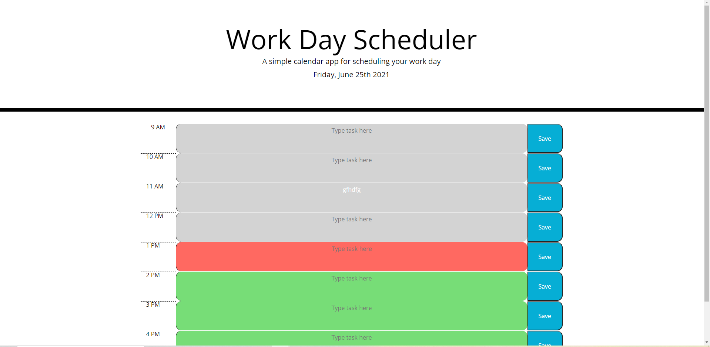

# day_scheduler
## Description

###### *last updated 6/25/2021
'''

The goal of this project was to recreate a daily planner utilizing some baseline code that will help manage my time effectively.

When the webpage is opened, a daily planner is opened and populated with stored tasks and the current day is displayed at the top of the calendar.

There are timeblocks for standard business hours, which I interpreted to mean 9am to 5pm for that day.

When a time block is clicked into, user can type text into.

When the save button is clicked, that info is saved into local storage. 

When the page is refreshed, the saved events persist.

This could eventually be expanded to include multiple days.

## Challenging aspect

The most challenging portion of this was to find a way to compare current hour to the hour I wanted to compare it to, to change the background colors of the timeblock.  This was accomplished through using the current time's hour and having my id be that specific hour and comparing the attr to that hour. 

'''

[Github Repository Link](https://github.com/roomsiejones/day_scheduler)

[Github Pages Deployment](https://roomsiejones.github.io/day_scheduler/)

